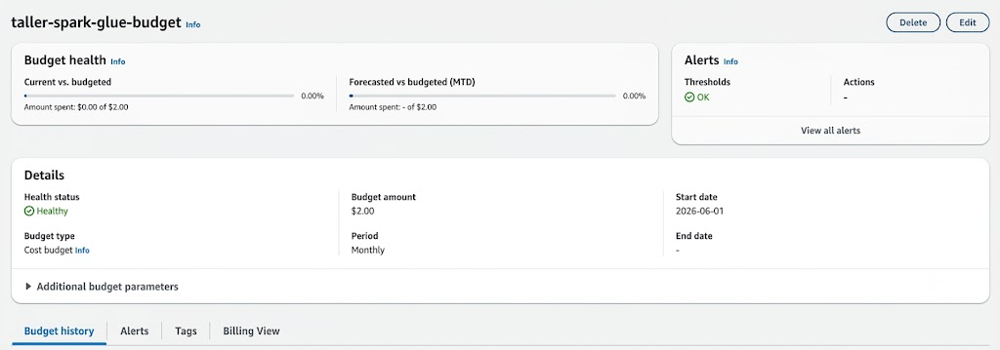
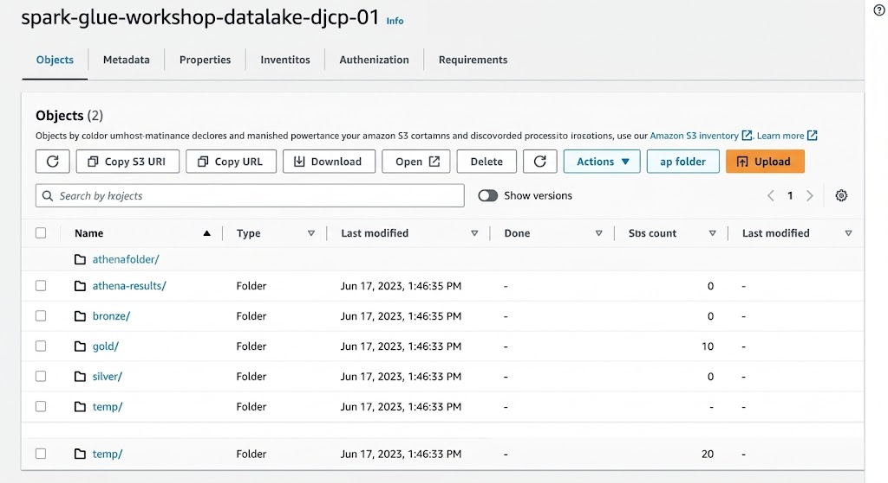
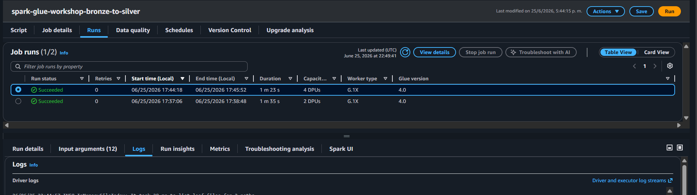

# Spark / AWS Glue Workshop

Pipeline ETL distribuido Bronze → Silver → Gold sobre el dataset Online Retail II,
construido con AWS Glue Studio, Step Functions y Athena.

## Evidencia del taller

### step_0_budget.png — Budget AWS
Budget `spark-glue-workshop-budget` ($2.00, Healthy) configurado en AWS Budgets.

### step_2_s3_bucket.png — Bucket S3 estructurado
Bucket `spark-glue-workshop-datalake-af-01` con las 5 carpetas requeridas:
- `bronze/` — CSVs originales (2 archivos, ~95 MB total)
- `silver/` — Parquet particionado por año (generado por job Bronze→Silver)
- `gold/` — Tablas dimensionales y de hechos (generado por job Silver→Gold)
- `athena-results/` — Resultados de consultas Athena
- `temp/` — Archivos temporales

### step_5_glue_silver_succeeded.png — Job Bronze→Silver completado
Job `spark-glue-workshop-bronze-to-silver` ejecutado en Glue Studio con estado **Succeeded**.
Procesa 1,067,371 filas, limpia, castea, filtra y escribe Parquet particionado por año en `s3://spark-glue-workshop-datalake-af-01/silver/`.

### step_6_glue_gold_succeeded.png — Job Silver→Gold completado
Job `spark-glue-workshop-silver-to-gold` ejecutado en Glue Studio con estado **Succeeded**.
Genera 4 tablas en `s3://spark-glue-workshop-datalake-af-01/gold/`:
- `dim_product` — 4,070 productos únicos
- `dim_customer` — 5,881 clientes únicos
- `dim_date` — Fechas únicas con atributos temporales
- `fact_sales` — Tabla de hechos con claves foráneas y métricas

### step_7_step_functions.png — State Machine ejecutada
State Machine `spark-glue-workshop-orchestrator` en Step Functions ejecutada exitosamente.
Orquesta secuencialmente: BronzeToSilver → SilverToGold con manejo de errores (Catch → PipelineFailed).

### step_8_athena_queries.png — Consultas Athena en workshop_gold
Athena configurado con output location `s3://spark-glue-workshop-datalake-af-01/athena-results/`.
Base de datos `workshop_gold` creada con 4 tablas externas. Queries de negocio ejecutadas:
- P1: Top 10 productos por revenue
- P2: Evolución mensual de revenue
- P3: Top 15 países por revenue
- P4: Top 5 clientes por gasto total

